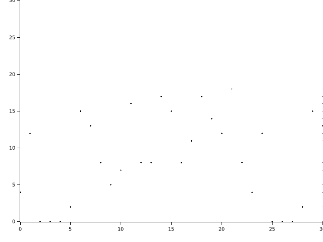

# GMiMC Hash test

First target is GMiMC as part of cryptoanalsis of zk-friendly hash function.

In here, implemenented [`GMiMC_erf`](https://byt3bit.github.io/primesym/gmimc/) hash function, which is that 

## Visualization

Running `main.rs` generate image like below. the results is based on a finite field with 23 as the modulus and utilizes 4 branches.

You can see more at [`results/gmimc_hash_output.ipynb`](./results/gmimc_hash_output.ipynb)
